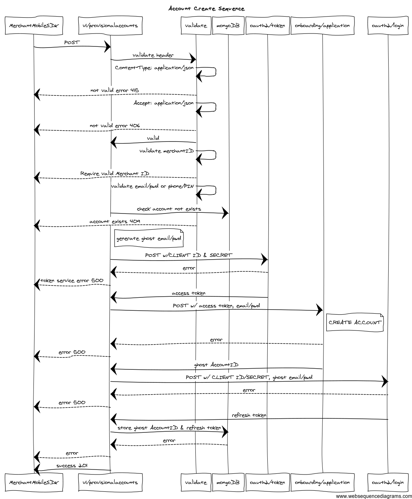
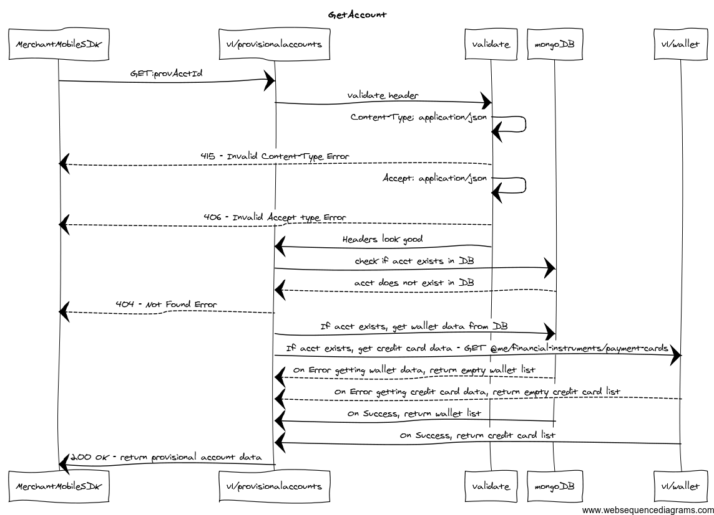
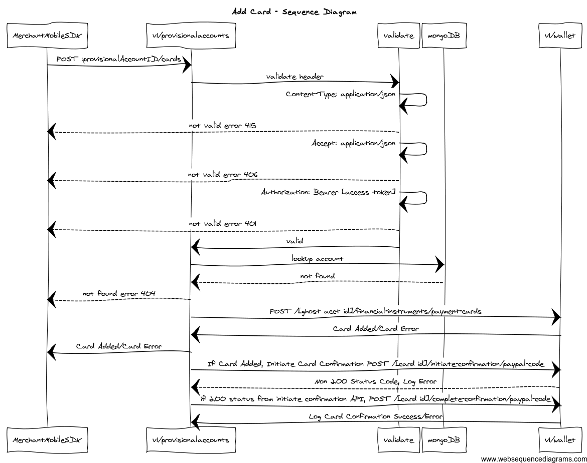
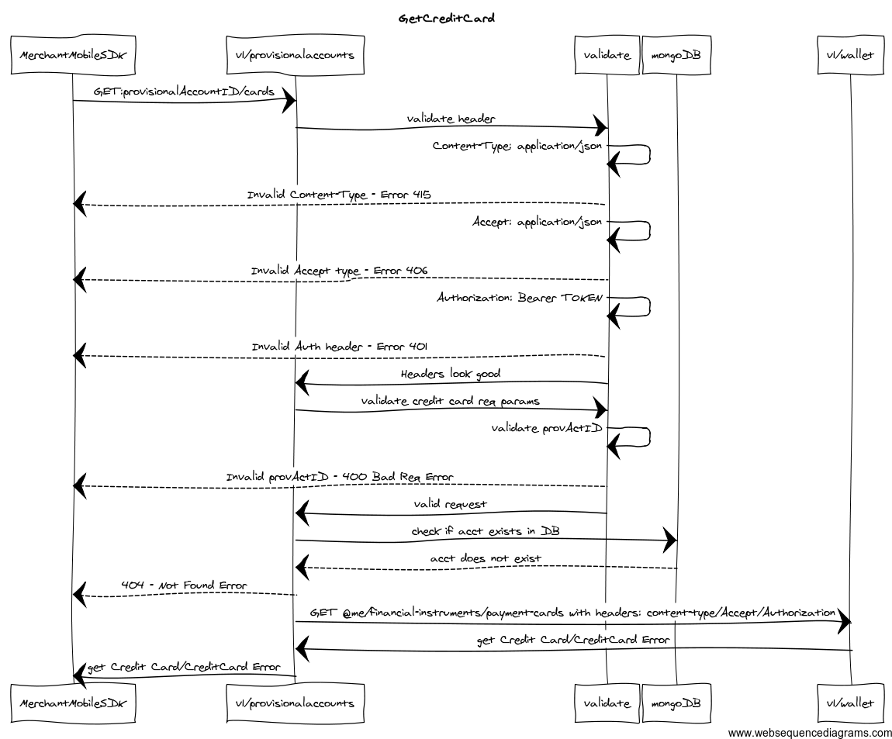
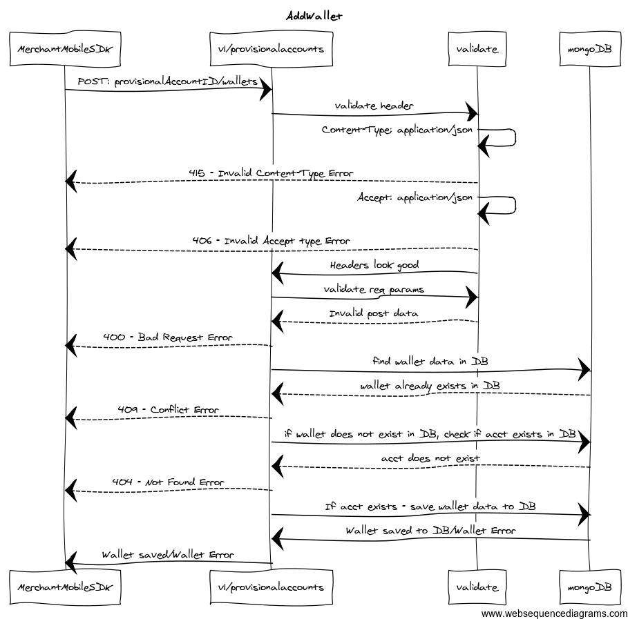
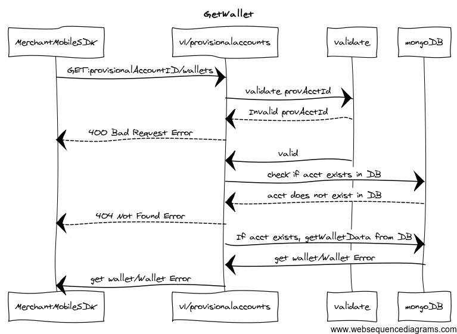

Sequence Diagrams:
------------------

- These are some sequence diagrams of what provisionalaccountserv is doing 

###1. Create Provisional Account 
---
###2. Get Provisional Account 
---
###3. Add Credit Card 
---
###4. Get Credit Cards 
---
###5. Add External Wallet 
---
###6. Get External Wallets 
---

Source for the Sequence Diagrams:
=================================

You can paste these into http://www.websequencediagrams.com.

1.  title Account Create Sequence

	MerchantMobileSDK->v1/provisionalaccounts: POST  
	v1/provisionalaccounts->validate: validate header  
  	validate->validate: Content-Type: application/json  
	validate-->MerchantMobileSDK: not valid error 415  
	validate->validate: Accept: application/json  
	validate-->MerchantMobileSDK: not valid error 406  
	validate->v1/provisionalaccounts: valid  
	validate->validate: validate merchantID  
	validate-->MerchantMobileSDK: Require valid Merchant ID  
	validate->validate: validate email/pwd or phone/PIN  
	v1/provisionalaccounts->mongoDB: check account not exists  
	validate-->MerchantMobileSDK: account exists 409  
		note right of v1/provisionalaccounts: generate ghost email/pwd  
	v1/provisionalaccounts->oauth2/token: POST w/CLIENT_ID & SECRET  
	oauth2/token-->v1/provisionalaccounts: error  
	v1/provisionalaccounts-->MerchantMobileSDK: token service error 500  
	oauth2/token->v1/provisionalaccounts: access token  
	v1/provisionalaccounts->onboarding/application: POST w/ access_token, email/pwd  
	note right of onboarding/application: CREATE_ACCOUNT  
	onboarding/application-->v1/provisionalaccounts: error  
	v1/provisionalaccounts-->MerchantMobileSDK: error 500  
	onboarding/application->v1/provisionalaccounts: ghost AccountID  
	v1/provisionalaccounts->oauth2/login: POST w/ CLIENT_ID/SECRET, ghost email/pwd  
	oauth2/login-->v1/provisionalaccounts: error  
	v1/provisionalaccounts-->MerchantMobileSDK: error 500   
	oauth2/login->v1/provisionalaccounts: refresh token  
	v1/provisionalaccounts->mongoDB: store ghost AccountID & refresh token  
	mongoDB-->v1/provisionalaccounts: error  
	v1/provisionalaccounts-->MerchantMobileSDK: error  
	v1/provisionalaccounts->MerchantMobileSDK: success 201  

2.  title Add Card - Sequence Diagram

	MerchantMobileSDK->v1/provisionalaccounts: POST :provisionalAccountID/cards  
	v1/provisionalaccounts->validate: validate header  
	validate->validate: Content-Type: application/json  
	validate-->MerchantMobileSDK: not valid error 415  
	validate->validate: Accept: application/json  
	validate-->MerchantMobileSDK: not valid error 406  
	validate->validate: Authorization: Bearer [access token]  
	validate-->MerchantMobileSDK: not valid error 401  
	validate->v1/provisionalaccounts: valid  
	v1/provisionalaccounts->mongoDB: lookup account  
	mongoDB-->v1/provisionalaccounts: not found  
	v1/provisionalaccounts-->MerchantMobileSDK: not found error 404  
	v1/provisionalaccounts->v1/wallet: POST /[ghost acct id]/financial-instruments/payment-cards  
	v1/wallet->v1/provisionalaccounts: Card Added/Card Error  
	v1/provisionalaccounts->MerchantMobileSDK: Card Added/Card Error  
	v1/provisionalaccounts->v1/wallet: If Card Added, Initiate Card Confirmation POST /[card_id]/initiate-confirmation/paypal-code  
	v1/wallet-->v1/provisionalaccounts: Non 200 Status Code, Log Error  
	v1/provisionalaccounts->v1/wallet: if 200 status from initiate confirmation API, POST /[card_id]/complete-confirmation/paypal-code  
	v1/wallet->v1/provisionalaccounts: Log Card Confirmation Success/Error  

3. title GetCreditCard

	MerchantMobileSDK->   v1/provisionalaccounts: GET:provisionalAccountID/cards 
	v1/provisionalaccounts->validate: validate header 
	validate->validate: Content-Type: application/json 
	validate-->MerchantMobileSDK: Invalid Content-Type - Error 415 
	validate->validate: Accept: application/json 
	validate-->MerchantMobileSDK: Invalid Accept type - Error 406 
	validate->validate: Authorization: Bearer TOKEN 
	validate-->MerchantMobileSDK: Invalid Auth header - Error 401 
	validate->v1/provisionalaccounts:Headers look good 
	v1/provisionalaccounts->validate: validate credit card req params 
	validate->validate: validate provActID 
	validate-->MerchantMobileSDK: Invalid provActID - 400 Bad Req Error 
	validate->v1/provisionalaccounts: valid request 
	v1/provisionalaccounts->mongoDB: check if acct exists in DB 
	mongoDB-->v1/provisionalaccounts: acct does not exist 
	v1/provisionalaccounts-->MerchantMobileSDK: 404 - Not Found Error 
	v1/provisionalaccounts->v1/wallet: GET @me/financial-instruments/payment-cards with headers: content-type/Accept/Authorization 
	v1/wallet->v1/provisionalaccounts: get Credit Card/CreditCard Error 
	v1/provisionalaccounts->MerchantMobileSDK: get Credit Card/CreditCard Error 

	
4. title GetWallet

	MerchantMobileSDK->   v1/provisionalaccounts: GET:provisionalAccountID/wallets 
	v1/provisionalaccounts->validate: validate provAcctId 
	validate-->v1/provisionalaccounts: Invalid provAcctId 
	v1/provisionalaccounts-->MerchantMobileSDK: 400 Bad Request Error 
	validate->v1/provisionalaccounts: valid 
	v1/provisionalaccounts->mongoDB: check if acct exists in DB 
	mongoDB-->v1/provisionalaccounts: acct does not exist in DB 
	v1/provisionalaccounts-->MerchantMobileSDK: 404 Not Found Error 
	v1/provisionalaccounts->mongoDB: If acct exists, getWalletData from DB 
	mongoDB->v1/provisionalaccounts: get wallet/Wallet Error 
	v1/provisionalaccounts->MerchantMobileSDK: get wallet/Wallet Error 
	
	
5. title AddWallet

	MerchantMobileSDK->   v1/provisionalaccounts: POST: provisionalAccountID/wallets 
	v1/provisionalaccounts->validate: validate header 
	validate->validate: Content-Type: application/json 
	validate-->MerchantMobileSDK: 415 - Invalid Content-Type Error 
	validate->validate: Accept: application/json 
	validate-->MerchantMobileSDK: 406 - Invalid Accept type Error 
	validate->v1/provisionalaccounts:Headers look good 
	v1/provisionalaccounts->validate: validate req params 
	validate-->v1/provisionalaccounts: Invalid post data 
	v1/provisionalaccounts-->MerchantMobileSDK: 400 - Bad Request Error 
	v1/provisionalaccounts->mongoDB: find wallet data in DB 
	mongoDB-->v1/provisionalaccounts: wallet already exists in DB 
	v1/provisionalaccounts-->MerchantMobileSDK: 409 - Conflict Error 
	v1/provisionalaccounts->mongoDB: if wallet does not exist in DB, check if acct exists in DB 
	mongoDB-->v1/provisionalaccounts: acct does not exist 
	v1/provisionalaccounts-->MerchantMobileSDK: 404 - Not Found Error 
	v1/provisionalaccounts->mongoDB: If acct exists - save wallet data to DB 
	mongoDB->v1/provisionalaccounts: Wallet saved to DB/Wallet Error 
	v1/provisionalaccounts->MerchantMobileSDK: Wallet saved/Wallet Error 

6. title GetAccount

	MerchantMobileSDK->v1/provisionalaccounts: GET:provAcctId 
	v1/provisionalaccounts->validate: validate header 
	validate->validate: Content-Type: application/json 
	validate-->MerchantMobileSDK: 415 - Invalid Content-Type Error 
	validate->validate: Accept: application/json 
	validate-->MerchantMobileSDK: 406 - Invalid Accept type Error 
	validate->v1/provisionalaccounts: Headers look good 
	v1/provisionalaccounts->mongoDB: check if acct exists in DB 
	mongoDB-->v1/provisionalaccounts: acct does not exist in DB 
	v1/provisionalaccounts-->MerchantMobileSDK: 404 - Not Found Error 
	v1/provisionalaccounts->mongoDB: If acct exists, get wallet data from DB 
	v1/provisionalaccounts->v1/wallet:If acct exists, get credit card data - GET @me/financial-instruments/payment-cards 
	mongoDB-->v1/provisionalaccounts: On Error getting wallet data, return empty wallet list 
	v1/wallet-->v1/provisionalaccounts: On Error getting credit card data, return empty credit card list 
	mongoDB->v1/provisionalaccounts: On Success, return wallet list 
	v1/wallet->v1/provisionalaccounts: On Success, return credit card list 
	v1/provisionalaccounts->MerchantMobileSDK: 200 OK - return provisional account data 
